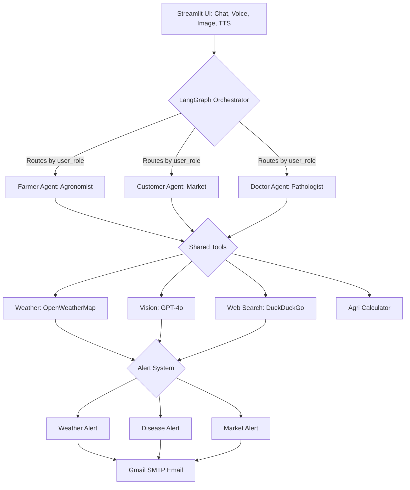
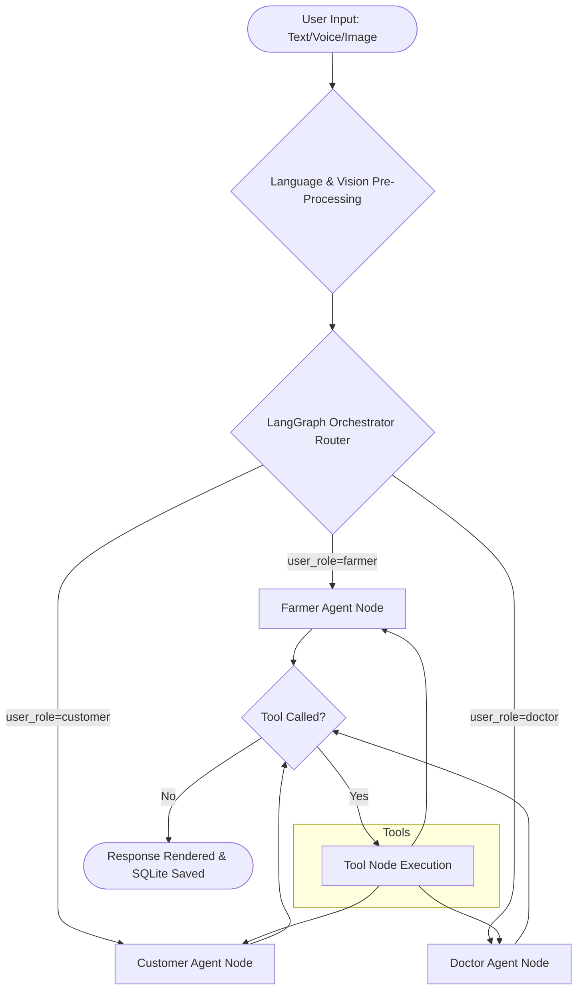

# KisanAI — Intelligent Multi-Agent Agricultural Advisory System

> **IMScience Hackathon 2026** | GPT-4o + LangGraph + Streamlit | Pakistan Agriculture

[](https://python.org)
[](https://github.com/langchain-ai/langgraph)
[](https://openai.com)
[](https://streamlit.io)
[](https://smith.langchain.com)
[](https://kisanai-23673755708.us-central1.run.app)

> **Live Demo:** https://kisanai-23673755708.us-central1.run.app

---

## System Architecture



---

## Orchestrator — Central Hub



> **Note:** As I use the OpenAI API for testing right now, the application will not work live unless valid API keys are configured in the environment.

---

## Features

| Feature | Description |
|---------|-------------|
| 3 GPT-4o Agents | Farmer / Customer / Crop Doctor with specialist prompts |
| Bilingual | Auto-detect EN/UR — Urdu renders RTL with Noto Nastaliq |
| Voice Input | OpenAI Whisper transcribes Urdu/English speech |
| Crop Vision | Upload photo — GPT-4o Vision diagnoses disease/pest |
| Named Chats | Threads auto-named from first message (like ChatGPT) |
| Smart Alerts | Email alerts for weather, disease, market price events |
| Demo Slider | Temperature slider triggers live alert email for demo |
| Memory | Full per-session history via LangGraph SQLite checkpointer |
| LangSmith | Every agent call traced with role, language, session metadata |

---

## Smart Alert System

| Alert Type | Trigger Condition | Email Content |
|------------|------------------|---------------|
| Weather | Temp >42C / <5C / Wind >40kmh | Heatwave/Frost/Storm warning + Urdu advice |
| Disease | Every GPT-4o crop image diagnosis | Full HTML report with severity badge |
| Market | Price change >20% in search results | Buy/sell recommendation + Urdu summary |

---

## Project Structure

```
IMScience_Hackthon2026/
+-- app.py                    Streamlit UI (dark theme, bilingual, named chats)
+-- orchestrator.py           LangGraph graph + routing + SQLite memory
+-- requirements.txt
+-- README.md
+-- .gitignore
+-- .env.example              Safe template (copy to .env)
|
+-- agents/
|   +-- farmer_agent.py       Agronomist (crops, fertilizer, irrigation)
|   +-- customer_agent.py     Market advisor (prices, selling, news)
|   +-- doctor_agent.py       Plant pathologist (disease, pesticides)
|
+-- tools/
|   +-- search_tool.py        DuckDuckGo search + market alert hook
|   +-- weather_tool.py       OpenWeatherMap API + weather alert hook
|   +-- vision_tool.py        GPT-4o Vision + disease alert hook
|   +-- calculator_tool.py    Yield / cost / dosage calculator
|
+-- utils/
    +-- language.py           Auto EN/UR language detection
    +-- voice.py              Whisper STT + gTTS TTS
    +-- alert_manager.py      Gmail SMTP alert engine (3 alert types)
```

---

## Tech Stack

| Layer | Technology | Role |
|-------|-----------|------|
| Agents | OpenAI GPT-4o | Reasoning + tool use + multilingual |
| Orchestration | LangGraph 1.1 | State graph + routing + memory |
| Vision | GPT-4o Vision | Crop disease image diagnosis |
| Voice STT | OpenAI Whisper | Urdu + English speech-to-text |
| Voice TTS | gTTS | Bilingual text-to-speech |
| Web Search | DuckDuckGo (pk-en) | Real-time agri info |
| Weather | OpenWeatherMap | Live weather + farming tips |
| Memory | SQLite + Checkpointer | Full conversation persistence |
| Tracing | LangSmith | Real-time agent debug dashboard |
| Alerts | Gmail SMTP (smtplib) | Weather / disease / price emails |
| UI | Streamlit | Dark theme bilingual chat interface |

---

## How to Run

```powershell
git clone https://github.com/Zahir-Ahmad9897/IMScience_Hackathon_2026.git
cd IMScience_Hackathon_2026
pip install -r requirements.txt
copy .env.example .env        # Fill in your API keys
streamlit run app.py --server.port 8501
```

Open: **http://localhost:8501**

---

## Environment Variables

```
OPENAI_API_KEY          GPT-4o agents + Vision + Whisper
GROQ_API_KEY            Backup fast inference
OPENWEATHER_API_KEY     Live weather data
LANGCHAIN_API_KEY       LangSmith tracing
ALERT_EMAIL_SENDER      Gmail address for sending alerts
ALERT_EMAIL_PASSWORD    Gmail App Password (16 chars)
ALERT_EMAIL_RECEIVER    Farmer email to receive alerts
```

---

**Built by Zahir Ahmad** | IMScience Hackathon 2026
